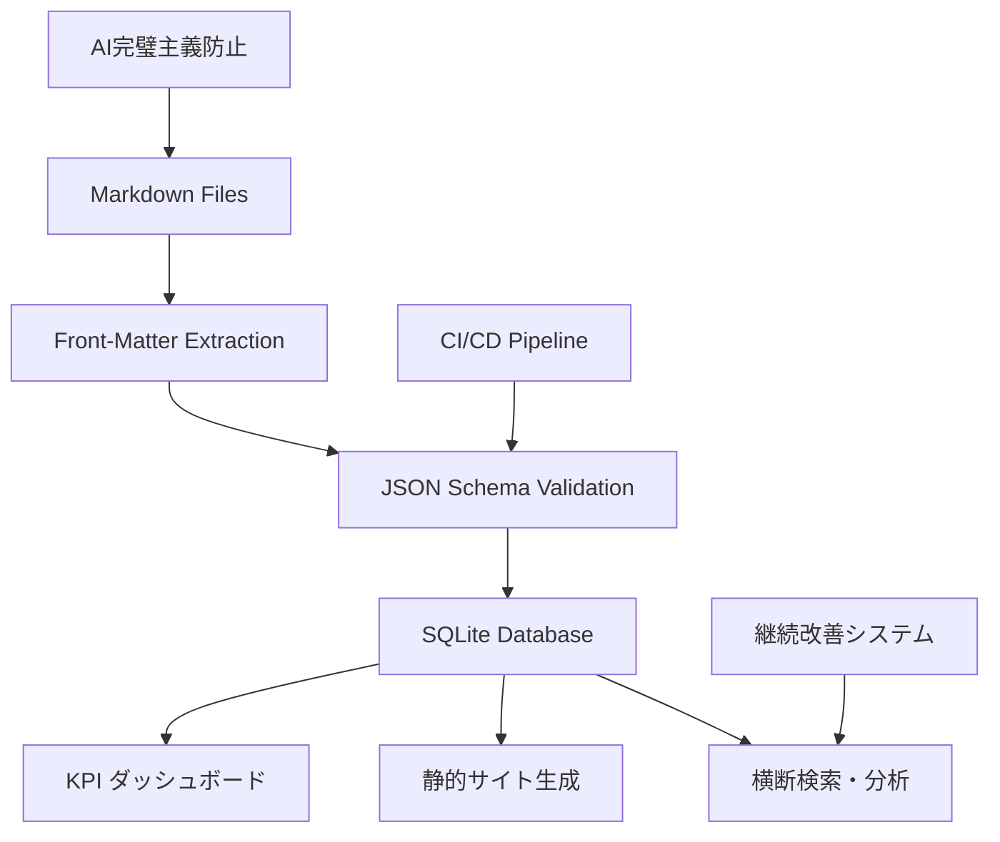

# ドキュメント複雑性制御システム 技術仕様

> **目的**: ADR-005で決定されたドキュメント複雑性制御システムの技術詳細・アーキテクチャ・実装仕様

## 📋 システム概要

### アーキテクチャモデル
```
ハイブリッド: Markdown + SQLite/DuckDB でメタデータ集約
```



### 設計原則
1. **Markdown一次ソース維持**: Git履歴・権限・diff追跡の保持
2. **構造化レイヤー追加**: SQLite による横断検索・集計機能
3. **段階的導入**: Week 1-6の計画的実装による最小リスク
4. **既存システム統合**: AI完璧主義防止・継続改善との相乗効果

---

## 🏗️ コンポーネント詳細仕様

### 1. Front-Matter標準化

#### 1.1 必須フィールド定義
```yaml
---
title: "文書タイトル（必須）"
status: "draft|active|deprecated"  # 必須
category: "governance|operations|reference|templates|quickstart"  # 必須
created: "YYYY-MM-DD"  # 必須
updated: "YYYY-MM-DD"  # 必須
---
```

#### 1.2 任意フィールド定義
```yaml
---
# 関連性・分類
adr: "005"  # 関連ADR番号
tags: ["complexity", "governance"]  # 複数タグ
priority: "high|medium|low"

# メタデータ
author: "システム名/担当者"
version: "1.0"
review_date: "YYYY-MM-DD"

# 関係性
depends_on: ["001-base-adr.md"]  # 依存文書
supersedes: ["old-doc.md"]      # 置換対象
---
```

#### 1.3 カテゴリ別仕様

##### governance
```yaml
---
title: "ADR-NNN: 決定事項タイトル"
status: "proposed|accepted|rejected|superseded"
category: "governance"
adr: "NNN"
decision_date: "YYYY-MM-DD"
review_date: "YYYY-MM-DD"
stakeholders: ["role1", "role2"]
---
```

##### operations
```yaml
---
title: "運用手順書タイトル"
status: "active"
category: "operations"
procedure_type: "daily|weekly|monthly|emergency"
automation_level: "manual|semi|auto"
dependencies: ["tool1", "tool2"]
---
```

##### reference
```yaml
---
title: "技術仕様書タイトル"
status: "active"
category: "reference"
technical_domain: "hooks|commands|architecture"
complexity_level: "basic|intermediate|advanced"
implementation_status: "design|prototype|stable"
---
```

### 2. JSON Schema仕様

#### 2.1 基本スキーマ構造
```json
{
  "$schema": "http://json-schema.org/draft-07/schema#",
  "title": "Claude Code Workspace Document Metadata",
  "type": "object",
  "required": ["title", "status", "category", "created", "updated"],
  "properties": {
    "title": {
      "type": "string",
      "minLength": 5,
      "maxLength": 100,
      "description": "ドキュメントタイトル"
    },
    "status": {
      "type": "string",
      "enum": ["draft", "active", "deprecated", "proposed", "accepted", "rejected", "superseded"],
      "description": "ドキュメントステータス"
    },
    "category": {
      "type": "string", 
      "enum": ["governance", "operations", "reference", "templates", "quickstart"],
      "description": "ドキュメントカテゴリ"
    },
    "created": {
      "type": "string",
      "format": "date",
      "description": "作成日"
    },
    "updated": {
      "type": "string", 
      "format": "date",
      "description": "最終更新日"
    },
    "adr": {
      "type": "string",
      "pattern": "^[0-9]{3}$",
      "description": "関連ADR番号（3桁）"
    },
    "tags": {
      "type": "array",
      "items": {"type": "string"},
      "maxItems": 10,
      "description": "分類タグ"
    },
    "priority": {
      "type": "string",
      "enum": ["high", "medium", "low"],
      "description": "優先度"
    }
  },
  "additionalProperties": false
}
```

#### 2.2 カテゴリ別拡張スキーマ

##### governance.schema.json
```json
{
  "allOf": [
    {"$ref": "base.schema.json"},
    {
      "properties": {
        "category": {"const": "governance"},
        "decision_date": {"type": "string", "format": "date"},
        "review_date": {"type": "string", "format": "date"},
        "stakeholders": {
          "type": "array",
          "items": {"type": "string"}
        }
      },
      "required": ["decision_date"]
    }
  ]
}
```

### 3. SQLite統合仕様

#### 3.1 データベーススキーマ
```sql
-- メインテーブル
CREATE TABLE docs_index (
    id INTEGER PRIMARY KEY AUTOINCREMENT,
    file_path TEXT UNIQUE NOT NULL,
    file_name TEXT NOT NULL,
    title TEXT NOT NULL,
    status TEXT NOT NULL,
    category TEXT NOT NULL,
    created DATE NOT NULL,
    updated DATE NOT NULL,
    
    -- 任意フィールド
    adr TEXT,
    priority TEXT,
    author TEXT,
    version TEXT,
    review_date DATE,
    
    -- 計算フィールド
    lines INTEGER,
    internal_links INTEGER,
    external_links INTEGER,
    words INTEGER,
    
    -- システムフィールド
    processed_at DATETIME DEFAULT CURRENT_TIMESTAMP,
    checksum TEXT,  -- 変更検出用
    
    -- インデックス
    CONSTRAINT status_check CHECK (status IN ('draft', 'active', 'deprecated', 'proposed', 'accepted', 'rejected', 'superseded')),
    CONSTRAINT category_check CHECK (category IN ('governance', 'operations', 'reference', 'templates', 'quickstart'))
);

-- タグテーブル（正規化）
CREATE TABLE doc_tags (
    id INTEGER PRIMARY KEY AUTOINCREMENT,
    doc_id INTEGER REFERENCES docs_index(id) ON DELETE CASCADE,
    tag TEXT NOT NULL,
    UNIQUE(doc_id, tag)
);

-- 関係性テーブル
CREATE TABLE doc_relationships (
    id INTEGER PRIMARY KEY AUTOINCREMENT,
    source_doc_id INTEGER REFERENCES docs_index(id) ON DELETE CASCADE,
    target_doc_id INTEGER REFERENCES docs_index(id) ON DELETE CASCADE,
    relationship_type TEXT NOT NULL, -- depends_on, supersedes, references
    UNIQUE(source_doc_id, target_doc_id, relationship_type)
);

-- インデックス
CREATE INDEX idx_docs_status ON docs_index(status);
CREATE INDEX idx_docs_category ON docs_index(category);
CREATE INDEX idx_docs_updated ON docs_index(updated);
CREATE INDEX idx_tags_tag ON doc_tags(tag);
```

#### 3.2 データ抽出・更新スクリプト

##### build_docs_db.py
```python
#!/usr/bin/env python3
"""
ドキュメントメタデータ抽出・SQLite統合スクリプト
"""

import os
import re
import sqlite3
import hashlib
import yaml
from pathlib import Path
from datetime import datetime
from typing import Dict, List, Optional

class DocumentProcessor:
    def __init__(self, db_path: str = "build/docs_index.sqlite"):
        self.db_path = db_path
        self.conn = None
        
    def connect(self):
        """データベース接続・初期化"""
        self.conn = sqlite3.connect(self.db_path)
        self.conn.execute("PRAGMA foreign_keys = ON")
        self._create_tables()
        
    def _create_tables(self):
        """テーブル作成"""
        with open('schemas/sqlite_schema.sql', 'r') as f:
            schema = f.read()
        self.conn.executescript(schema)
        
    def extract_frontmatter(self, content: str) -> Optional[Dict]:
        """Front-Matter抽出"""
        if not content.startswith('---\n'):
            return None
            
        try:
            _, yaml_content, _ = content.split('---\n', 2)
            return yaml.safe_load(yaml_content)
        except (ValueError, yaml.YAMLError) as e:
            print(f"Front-Matter parse error: {e}")
            return None
            
    def analyze_content(self, content: str) -> Dict:
        """コンテンツ解析"""
        return {
            'lines': len(content.splitlines()),
            'words': len(content.split()),
            'internal_links': len(re.findall(r'\[.*?\]\([^)]*\.md\)', content)),
            'external_links': len(re.findall(r'\[.*?\]\(https?://[^)]+\)', content))
        }
        
    def process_file(self, file_path: Path) -> bool:
        """単一ファイル処理"""
        try:
            with open(file_path, 'r', encoding='utf-8') as f:
                content = f.read()
                
            # チェックサム計算
            checksum = hashlib.md5(content.encode()).hexdigest()
            
            # 既存レコード確認
            existing = self.conn.execute(
                "SELECT checksum FROM docs_index WHERE file_path = ?", 
                (str(file_path),)
            ).fetchone()
            
            if existing and existing[0] == checksum:
                return False  # 変更なし
                
            # Front-Matter抽出
            frontmatter = self.extract_frontmatter(content)
            if not frontmatter:
                print(f"⚠️ No front-matter: {file_path}")
                return False
                
            # コンテンツ解析
            analysis = self.analyze_content(content)
            
            # データベース更新
            self._upsert_document(file_path, frontmatter, analysis, checksum)
            return True
            
        except Exception as e:
            print(f"❌ Error processing {file_path}: {e}")
            return False
            
    def _upsert_document(self, file_path: Path, frontmatter: Dict, analysis: Dict, checksum: str):
        """ドキュメントレコード更新・挿入"""
        # メインレコード
        self.conn.execute("""
            INSERT OR REPLACE INTO docs_index (
                file_path, file_name, title, status, category, created, updated,
                adr, priority, author, version, review_date,
                lines, internal_links, external_links, words,
                checksum, processed_at
            ) VALUES (?, ?, ?, ?, ?, ?, ?, ?, ?, ?, ?, ?, ?, ?, ?, ?, ?, ?)
        """, (
            str(file_path), file_path.name,
            frontmatter.get('title', ''), frontmatter.get('status', ''),
            frontmatter.get('category', ''), frontmatter.get('created', ''),
            frontmatter.get('updated', ''), frontmatter.get('adr'),
            frontmatter.get('priority'), frontmatter.get('author'),
            frontmatter.get('version'), frontmatter.get('review_date'),
            analysis['lines'], analysis['internal_links'],
            analysis['external_links'], analysis['words'],
            checksum, datetime.now()
        ))
        
        doc_id = self.conn.lastrowid
        
        # タグ更新
        self.conn.execute("DELETE FROM doc_tags WHERE doc_id = ?", (doc_id,))
        for tag in frontmatter.get('tags', []):
            self.conn.execute(
                "INSERT INTO doc_tags (doc_id, tag) VALUES (?, ?)",
                (doc_id, tag)
            )
            
        self.conn.commit()
        
    def process_all(self) -> Dict:
        """全ドキュメント処理"""
        stats = {'processed': 0, 'updated': 0, 'errors': 0}
        
        for md_file in Path('.').rglob('*.md'):
            if self._should_skip(md_file):
                continue
                
            stats['processed'] += 1
            if self.process_file(md_file):
                stats['updated'] += 1
                
        return stats
        
    def _should_skip(self, file_path: Path) -> bool:
        """処理除外判定"""
        skip_patterns = [
            'node_modules/', '.git/', 'build/', '__pycache__/',
            'README.md'  # プロジェクトREADMEは除外
        ]
        return any(pattern in str(file_path) for pattern in skip_patterns)

if __name__ == "__main__":
    processor = DocumentProcessor()
    processor.connect()
    stats = processor.process_all()
    print(f"📊 処理完了: {stats}")
```

### 4. CI統合仕様

#### 4.1 GitHub Actions設定
```yaml
# .github/workflows/docs-ci.yml
name: Documentation Quality & Complexity Control

on:
  push:
    paths: ['**/*.md']
  pull_request:
    paths: ['**/*.md']

env:
  NODE_VERSION: '18'
  PYTHON_VERSION: '3.9'

jobs:
  docs-validation:
    runs-on: ubuntu-latest
    
    steps:
      - name: Checkout
        uses: actions/checkout@v3
        
      - name: Setup Node.js
        uses: actions/setup-node@v3
        with:
          node-version: ${{ env.NODE_VERSION }}
          
      - name: Setup Python
        uses: actions/setup-python@v4
        with:
          python-version: ${{ env.PYTHON_VERSION }}
          
      - name: Install Dependencies
        run: |
          npm install -g remark-cli remark-lint-frontmatter-schema
          pip install pyyaml jsonschema
          
      - name: Front-Matter Schema Validation
        run: |
          echo "🔍 Front-Matter validation..."
          find . -name "*.md" -not -path "./node_modules/*" -not -path "./.git/*" | \
          xargs python scripts/validate_frontmatter.py
          
      - name: Document Complexity Check
        run: |
          echo "📊 Complexity analysis..."
          python scripts/doc_inventory.py --ci-mode
          
      - name: Internal Link Validation
        run: |
          echo "🔗 Link validation..."
          python scripts/link_checker.py --strict
          
      - name: SQLite Database Update
        if: github.event_name == 'push' && github.ref == 'refs/heads/main'
        run: |
          echo "💾 Database update..."
          python scripts/build_docs_db.py
          
      - name: Upload Artifacts
        uses: actions/upload-artifact@v3
        if: always()
        with:
          name: docs-analysis
          path: |
            build/docs_analysis.json
            build/docs_index.sqlite
```

#### 4.2 検証スクリプト仕様

##### validate_frontmatter.py
```python
#!/usr/bin/env python3
import sys
import json
import yaml
import jsonschema
from pathlib import Path

def validate_document(file_path: Path, schema: dict) -> bool:
    """単一ドキュメントのFront-Matter検証"""
    try:
        with open(file_path, 'r', encoding='utf-8') as f:
            content = f.read()
            
        if not content.startswith('---\n'):
            print(f"❌ {file_path}: Front-Matter missing")
            return False
            
        _, yaml_content, _ = content.split('---\n', 2)
        frontmatter = yaml.safe_load(yaml_content)
        
        # カテゴリ別スキーマ選択
        category = frontmatter.get('category', 'base')
        schema_file = f"schemas/{category}.schema.json"
        
        if Path(schema_file).exists():
            with open(schema_file, 'r') as f:
                category_schema = json.load(f)
            jsonschema.validate(frontmatter, category_schema)
        else:
            jsonschema.validate(frontmatter, schema)
            
        print(f"✅ {file_path}: Valid")
        return True
        
    except Exception as e:
        print(f"❌ {file_path}: {e}")
        return False

def main():
    # ベーススキーマ読み込み
    with open('schemas/md-meta.schema.json', 'r') as f:
        base_schema = json.load(f)
        
    # 全Markdownファイル検証
    errors = 0
    for md_file in Path('.').rglob('*.md'):
        if 'node_modules' in str(md_file) or '.git' in str(md_file):
            continue
            
        if not validate_document(md_file, base_schema):
            errors += 1
            
    if errors > 0:
        print(f"💥 {errors} validation errors found")
        sys.exit(1)
    else:
        print("🎉 All documents valid")

if __name__ == "__main__":
    main()
```

### 5. 横断検索・分析API

#### 5.1 クエリインターフェース
```python
class DocumentSearchAPI:
    def __init__(self, db_path: str):
        self.db = sqlite3.connect(db_path)
        
    def search_by_tags(self, tags: List[str]) -> List[Dict]:
        """タグベース検索"""
        placeholders = ','.join(['?' for _ in tags])
        query = f"""
            SELECT DISTINCT d.* FROM docs_index d
            JOIN doc_tags t ON d.id = t.doc_id
            WHERE t.tag IN ({placeholders})
        """
        return [dict(row) for row in self.db.execute(query, tags)]
        
    def search_by_category(self, category: str, status: str = 'active') -> List[Dict]:
        """カテゴリ・ステータス検索"""
        query = """
            SELECT * FROM docs_index 
            WHERE category = ? AND status = ?
            ORDER BY updated DESC
        """
        return [dict(row) for row in self.db.execute(query, (category, status))]
        
    def get_complexity_metrics(self) -> Dict:
        """複雑性メトリクス取得"""
        metrics = {}
        
        # 基本統計
        stats = self.db.execute("""
            SELECT 
                COUNT(*) as total_docs,
                AVG(lines) as avg_lines,
                MAX(lines) as max_lines,
                AVG(internal_links) as avg_links
            FROM docs_index WHERE status = 'active'
        """).fetchone()
        
        metrics['basic_stats'] = dict(stats) if stats else {}
        
        # カテゴリ別分布
        category_dist = self.db.execute("""
            SELECT category, COUNT(*) as count, AVG(lines) as avg_lines
            FROM docs_index WHERE status = 'active'
            GROUP BY category
        """).fetchall()
        
        metrics['category_distribution'] = [dict(row) for row in category_dist]
        
        # 複雑性ホットスポット
        hotspots = self.db.execute("""
            SELECT file_path, title, lines, internal_links
            FROM docs_index 
            WHERE lines > 500 OR internal_links > 10
            ORDER BY lines DESC, internal_links DESC
        """).fetchall()
        
        metrics['complexity_hotspots'] = [dict(row) for row in hotspots]
        
        return metrics
        
    def get_outdated_documents(self, days: int = 90) -> List[Dict]:
        """古いドキュメント検出"""
        query = """
            SELECT * FROM docs_index 
            WHERE status = 'active' 
              AND date(updated) < date('now', '-{} days')
            ORDER BY updated ASC
        """.format(days)
        
        return [dict(row) for row in self.db.execute(query)]
```

---

## 🔧 実装例・使用例

### 新規ドキュメント作成テンプレート
```markdown
---
title: "新機能設計書: ユーザー認証システム"
status: "draft"
category: "reference"
created: "2025-07-14"
updated: "2025-07-14"
tags: ["authentication", "security", "api"]
priority: "high"
author: "development-team"
review_date: "2025-07-21"
depends_on: ["003-security-requirements.md"]
---

# 新機能設計書: ユーザー認証システム

## 概要
...
```

### 複雑性分析クエリ例
```sql
-- 最も複雑なドキュメント TOP 10
SELECT file_path, title, lines, internal_links,
       (lines * 0.1 + internal_links * 2) as complexity_score
FROM docs_index 
WHERE status = 'active'
ORDER BY complexity_score DESC
LIMIT 10;

-- カテゴリ別平均複雑性
SELECT category, 
       COUNT(*) as docs,
       AVG(lines) as avg_lines,
       AVG(internal_links) as avg_links,
       AVG(lines * 0.1 + internal_links * 2) as avg_complexity
FROM docs_index 
WHERE status = 'active'
GROUP BY category;

-- 更新頻度分析
SELECT 
    CASE 
        WHEN date(updated) > date('now', '-7 days') THEN 'Recent'
        WHEN date(updated) > date('now', '-30 days') THEN 'Month'
        WHEN date(updated) > date('now', '-90 days') THEN 'Quarter'
        ELSE 'Stale'
    END as freshness,
    COUNT(*) as count
FROM docs_index 
WHERE status = 'active'
GROUP BY freshness;
```

### CI統合でのアラート例
```bash
# 複雑性違反検出
echo "🚨 Document Complexity Violations:"
sqlite3 docs_index.db "
    SELECT file_path, lines FROM docs_index 
    WHERE lines > 500 AND status = 'active'
" | while read file lines; do
    echo "  - $file: $lines lines (> 500 limit)"
done

# 未完了 Front-Matter 検出
echo "⚠️ Missing Front-Matter:"
find . -name "*.md" -exec grep -L "^---" {} \; | head -10
```

---

## 📈 効果測定・KPI定義

### 実装効果指標
```sql
-- Front-Matter適用率
SELECT 
    (COUNT(CASE WHEN title IS NOT NULL THEN 1 END) * 100.0 / COUNT(*)) as coverage_rate
FROM docs_index;

-- 複雑性改善率
SELECT 
    AVG(CASE WHEN lines <= 500 THEN 1.0 ELSE 0.0 END) as manageable_size_rate,
    AVG(CASE WHEN internal_links <= 10 THEN 1.0 ELSE 0.0 END) as manageable_links_rate
FROM docs_index WHERE status = 'active';

-- 検索効率改善
-- Before: 手動grep検索時間 vs After: SQLiteクエリ時間
```

### 定期モニタリング
```python
def generate_weekly_report():
    """週次複雑性レポート生成"""
    api = DocumentSearchAPI('docs_index.db')
    
    report = {
        'timestamp': datetime.now(),
        'metrics': api.get_complexity_metrics(),
        'hotspots': api.get_complexity_hotspots(),
        'outdated': api.get_outdated_documents(30),
        'frontmatter_coverage': api.get_frontmatter_coverage()
    }
    
    # JSON/HTML レポート出力
    with open('build/weekly_complexity_report.json', 'w') as f:
        json.dump(report, f, indent=2, default=str)
        
    return report
```

---

## 🔗 システム統合仕様

### AI完璧主義防止システム（ADR-003）との統合
```bash
# constitution-guard.sh での複雑性チェック統合
check_document_complexity() {
    local files=("$@")
    
    for file in "${files[@]}"; do
        # 行数チェック
        local lines=$(wc -l < "$file")
        if [[ $lines -gt 500 ]]; then
            echo "⚠️ 複雑性違反: $file ($lines 行 > 500行制限)"
            echo "ADR-005に従い、以下を検討してください:"
            echo "1. 文書分割"
            echo "2. 構造化改善"  
            echo "3. 不要な詳細削除"
            return 1
        fi
        
        # Front-Matter必須チェック
        if ! head -1 "$file" | grep -q "^---"; then
            echo "❌ Front-Matter未設定: $file"
            echo "schemas/md-meta.schema.json に従いメタデータを追加してください"
            return 1
        fi
    done
    
    return 0
}
```

### 継続改善システム（ADR-002）との統合
```python
# improvement_recommendations.md への自動統合
def update_improvement_recommendations():
    api = DocumentSearchAPI('docs_index.db')
    hotspots = api.get_complexity_hotspots()
    
    recommendations = []
    for doc in hotspots:
        if doc['lines'] > 500:
            recommendations.append({
                'id': f"DOC-COMPLEX-{doc['id']}",
                'category': 'Document Complexity',
                'description': f"大型文書の分割: {doc['file_path']} ({doc['lines']}行)",
                'priority': 'medium',
                'implementation': 'セクション分割・別文書化',
                'related_adr': 'ADR-005'
            })
            
    return recommendations
```

---

*この技術仕様書は、ADR-005で決定されたドキュメント複雑性制御システムの実装・運用・統合に必要な全技術詳細を網羅し、既存システムとの一元的な品質管理を実現します。*

*作成日: 2025-07-14*  
*バージョン: 1.0*  
*次回レビュー: Week 3 CI統合完了時*